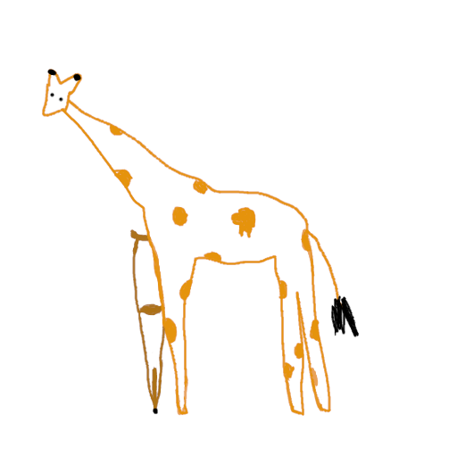
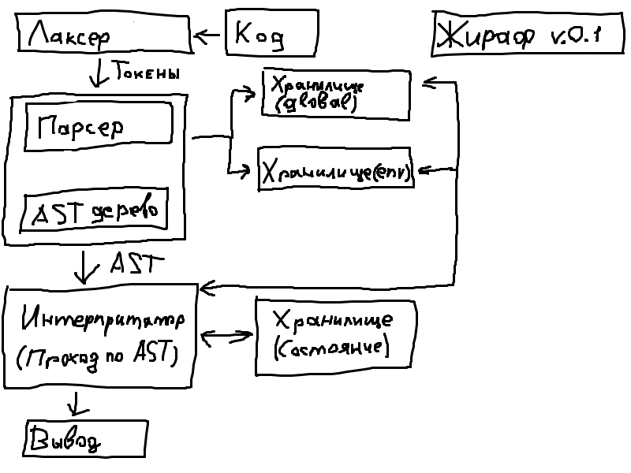

# Giraffe-Language

**Giraffe-Language** — это язык программирования, ориентированный на создание скриптов для автоматизации процессов и разработки удобных интерфейсов для сложных проектов. 

## Текущий статус

На данный момент проект находится на стадии разработки теоретической части и планирования. Ожидается, что следующие этапы будут включать:

- Разработка интерпретатора
- Разработка парсера и токенизатора
- Реализация структуры хранения переменных и состояния
- Оптимизация производительности и добавление новых фич

## Цели:

- Автоматизация: Giraffe-Language предоставляет простые и гибкие возможности для автоматизации задач, что идеально подходит для настройки и обслуживания процессов, а также для работы с API и системами.

- Удобные интерфейсы: Язык ориентирован на создание удобных и читаемых интерфейсов, которые помогут интегрировать и управлять сложными проектами через легкие в использовании скрипты.

- Интерактивность и гибкость: Язык поддерживает динамическую работу с данными и интерфейсами, позволяя быстро изменять поведение системы через скрипты.

## Конецепт:

### Графичиская схема роботы:

### Описание концепта/схемы:

#### Лаксер (Токенайзер)
Разбивает исходный код на токены, представляя его в виде более простых элементов для дальнейшей обработки

#### Парсер
Обрабатывает токены, строит абстрактное синтаксическое дерево (AST) и отправляет данные в хранилище для дальнейшей работы

#### Интерпритатор
Проходит по AST, работает с хранилищем переменных (`env` или `global`), а также обновляет состояние интерпретатора, включая указатель на текущую инструкцию и другие параметры

#### Хранилищ `env`/`state`
Хранилище перемененных состоит из 
- имя переменной
- тип перемнной 
- значение 

В хранилище переменные добавляются при инициализации если переменная определена, если нет то при ее определении

#### Хранилище `state`
Содержит информацию необходимую для интерпретатора в текущий момент. 

**Описание `state`:**

- Очередь вызовов 
- Указатель инструкции (номер или строка в AST дереве исполняемого узла)
- Регистр перемененных - временные переменные только для интерпретатора 

####  ***Опционально для `state`:***

- Последняя ошибка
- Состояние роботы интерпретатора
- Отладочный режим

## Идеи по улучшению концепта:

**Мемоизация вычислений:** Для часто встречающихся выражений можно хранить уже вычисленные результаты и возвращать их при повторных вызовах, чтобы избежать лишних вычислений.

**Снимки состояния:** На определённых этапах работы программы можно делать "снимки" состояния для отката в случае ошибки или для возврата к состоянию на определённой инструкции.

**Поддержка замыканий:** Механизм замыканий позволяет переменным сохранять своё значение даже после выхода из области видимости, где они были определены. Это полезно для реализации лямбда-функций или обработчиков.

**Использование слабых ссылок:** Для некоторых объектов, например, временных данных, можно использовать слабые ссылки `weak references`, чтобы избежать утечек памяти при удалении ненужных объектов.

**Поддержка динамических и статических типов**.

## Лицензия

Этот проект лицензирован под MIT License - подробности см. в файле [LICENSE](LICENSE).